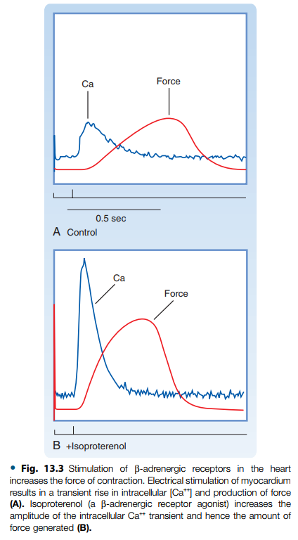

# Cardiology

## Cellular structure and function of the heart

① The basic contractile unit of a cardiac myocyte is the **sarcomere**, which contains thick filaments (*myosin*) and thin filaments (*actin, troponin, and tropomyosin*) that are involved in muscle contraction.

  

  

② The thick filaments are composed of myosin molecules, with each molecule having two myosin heads, which serve as the site of the myosin ATPase. Thin filaments are composed of actin, tropomyosin, and regulatory proteins (*troponin complex, TN*) having three subunits: **TN-T** (binds to tropomyosin), **TN-C** (binds to calcium ions), and **TN-I** (inhibitory troponin, which inhibits myosin binding to actin). Calcium binding to TN-C produces a conformation change in the troponin–tropomyosin complex that exposes a myosin-binding site on the actin, leading to ATP hydrolysis.

 &nbsp;&nbsp;&nbsp;&nbsp;&nbsp;

  

  

  

>**Summary of Excitation-Contraction Coupling**
>
>[1] Ca++ enters cell through voltage-gated Ca++ channels during depolarization, which triggers release of Ca++ into the cytoplasm through calcium release channels (*ryanodine receptors, RyR*) located on the terminal cisternae.
>
>[2] Ca++ binds to TN-C, inducing a conformational change in the troponin complex that exposes myosin-binding sites on actin.
>
>[3] Myosin heads bind to actin, leading to cross-bridge movement (requires ATP hydrolysis) and reduction in sarcomere length.
>
>[4] Ca++ is resequestered by sarcoplasmic reticulum by **sarcoendoplasmic reticulum calcium ATPase** (*SERCA pump*) that is inhibited by phospholamban.
>
>[5] Ca++ is removed from TN-C, and myosin unbinds from actin (requires ATP); this allows the sarcomere to resume its original, relaxed length.

 

  

>*Abbreviation. R, receptor; Gs, stimulatory G-protein; Gi, inhibitory G-protein; Gq, phospholipase C–coupled G-protein; AC, adenylyl cyclase; PL-C, phospholipase C; PIP2, phosphatidylinositol 4,5-bisphosphate; DAG, diacylglycerol; PK-C, protein kinase C; PK-A, protein kinase A; SR, sarcoplasmic reticulum; ATP, adenosine triphosphate; NE, norepinephrine; AII, angiotensin II; ET-1, endothelin-1; Epi, epinephrine; ACh, acetylcholine; Ado, adenosine.

 

③ **Inotropy** can be increased by  
 - increasing Ca++ influx through L-type Ca++ channels (*site 1*)  
 - increasing release of Ca++ by the sarcoplasmic reticulum (*site 2*)  
 - increasing troponin C (TN-C) affinity for Ca++ (*site 3*)  
 - increasing myosin ATPase activity through phosphorylation of myosin heads (*site 4*)  
 - increasing SERCA activity by phosphorylation of phospholamban (*site 5*)  
 - inhibiting Ca++ efflux across the sarcolemma (*site 6*)

 

④ The two major pathways involve formation of either cyclic adenosine monophosphate (*cAMP*) or inositol 1,4,5-triphosphate (*IP3*), both of which affect Ca++ release by sarcoplasmic reticulum and therefore affect contraction.

 

⑤ Excitation–contraction coupling is initiated by depolarization of the cardiac myocyte and is controlled by changes in **intracellular calcium**, which binds to regulatory proteins on the thin filaments; ATP is required for contraction and relaxation.

 

⑥ Relaxation of cardiac myocytes (*lusitropy*) is primarily regulated by the reuptake of calcium into the sarcoplasmic reticulum by the SERCA pump.

  

  

⑦ Arteries and veins are arranged as three layers: *adventitia*, *media*, and *intima*. Autonomic nerves and small blood vessels (vasa vasorum in large vessels) are found in the adventitia; vascular smooth muscle is found in the media; and the intima is lined by the endothelium.

 

  

⑧ Vascular smooth muscle contains actin and myosin; however, these components are not arranged in the same repetitive pattern as that found in cardiac myocytes. Unlike cardiac muscle contraction, vascular smooth muscle contraction is slow and sustained.

 

  

⑨ Increased intracellular calcium, by either increased entry into the cell (through L-type Ca++ channels) or release from the sarcoplasmic reticulum, forms a complex with **calmodulin**, activating myosin light chain kinase (*MLCK*), which phosphorylates myosin light chains (*MLC*), causing contraction. Dephosphorylation of myosin light chains by myosin light chain phosphatase (*MLCP*) produces relaxation.

 

  

>*Abbreviation. R, receptor; Gs, stimulatory G-protein; Gq, phospholipase C–coupled G-protein; IP3, inositol triphosphate; SR, sarcoplasmic reticulum; MLCK, myosin light chain kinase; MLCP, myosin light chain phosphatase; NO, nitric oxide; GC, guanylyl cyclase; GTP, guanosine triphosphate; ATP, adenosine triphosphate; cAMP, cyclic adenosine monophosphate; cGMP, cyclic guanosine monophosphate; α1, alpha-1-adrenoceptor; ETA, endothelin-1 type A receptor; V1, vasopressin type 1 receptor; AT1, angiotensin type 1 receptor; M3, muscarinic type 3 receptor β2, beta-2-adrenoceptor; A2, adenosine type 2 receptor; IP, prostacyclin (prostaglandin I2) receptor; α2, alpha-2-adrenoceptor.

 

⑩ **Cardiac muscle contraction** is regulated by various substances that bind to receptors coupled to G-proteins. Vascular smooth muscle contraction/relaxation is additionally regulated by NO/cGMP-dependent pathways. All these pathways largely affect contraction/relaxation primarily by regulating intracellular calcium and/or by altering protein phosphorylation. 

 

|G-Protein (Response)|Secondary messenger pathway|Receptor|Biological Agonist|
|---|---|---|---|
|**Gs-protein (relaxation)**|↑cAMP|β2|*Epinephrine*|
|||A2|*Adenosine*|
|||IP|*Prostacyclin*|
|**Gi-protein (contraction)**|↓cAMP|α2|*Norepinephrine and epinephrine*|
|**Gq-protein (contraction)**|↑IP3|α1|*Epinephrine*|
||↑Rho-kinase|ETA|*Endothelin-1*|
|||AT1|*Angiotensin II*|
|||V1|*Vasopressin*|
|||M3|*Acetylcholine*|

>*Abbreviation. Gs, stimulatory G-protein; Gi, inhibitory G-protein; Gq, phospholipase C–coupled G-protein; cAMP, cyclic adenosine monophosphate; IP3, inositol 1,4,5-triphosphate; β2, beta-2-adrenoceptor; A2, adenosine type 2 receptor; IP, prostacyclin (prostaglandin I2) receptor; α2, alpha-2-adrenoceptor; α1, alpha-1-adrenoceptor; ETA, endothelin-1 type A receptor; AT1, angiotensin type 1 receptor; V1, vasopressin type 1 receptor, M3, muscarinic type 3 receptor.

 

  

⑪ The vascular endothelium synthesizes **nitric oxide and prostacyclin**, both of which relax vascular smooth muscle. **Endothelin-1**, which is also synthesized by the endothelium, contracts vascular smooth muscle. 

## Electrical activity of the Heart

① The **membrane potential** is determined primarily by the concentration of sodium, potassium, and calcium ions across the cell membrane, and by the relative conductances of the membrane to these ions.

 

② The resting membrane potential is very close to the potassium equilibrium potential (calculated from Nernst equation) because the relative conductance of potassium is much higher than the relative conductances of sodium and calcium in the resting cell.

 

>Concentrations of K+, Na+, and Ca++ inside and outside a cardiac myocyte at a resting membrane potential of −90 mV.

 

③ Ions move across the cell membrane through ion-selective channels, which have open (activated) and closed (inactivated) states that are regulated either by membrane voltage or by receptor-coupled mechanisms.

  

  

 

④ Concentrations of sodium, potassium, and calcium across the cell membrane are maintained by the Na+/K+-ATPase pump, the Na+/Ca++ exchanger, and the Ca++-ATPase pump.

  

  

>Phase 0 (depolarization) primarily is due to the rapid increase in sodium conductance (gNa) accompanied by a fall in potassium conductance (gK; K1 channel closing).  
the initial repolarization of phase 1 is due to opening of transient outward potassium channels (gKto).  
phase 2 (plateau) primarily is due to an increase in slow inward calcium conductance (gCa) through L-type Ca++ channels.   
phase 3 (repolarization) results from an increase in gK (Kr and Ks channels) and a decrease in gCa.  
Phase 4 is a true resting potential that primarily reflects a high gK (K1 channels). ERP, effective refractory period.

 

  

|Channels|Characteristics|
|---|---|
|**Sodium**||
|Fast Na+ (INa)|Phase 0 of myocytes|
|Slow Na+ (If)|Contributes to phase 4 pacemaker current in SA and AV nodal cells|
|**Calcium**||
|L-type (ICa)|Slow inward, long-lasting current; phase 2 of myocytes and phases 4 and 0 of SA and AV nodal cells|
|---|---|
|---|---|
|---|---|
|---|---|
|---|---|
|---|---|

## Cardiac function

## Vascular function

## Exchange Function of the Microcirculation

## Cardiovascular pathophysiology

