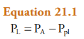

# Pulmonology

2.1 Introduction to the Respiratory system  
2.2 Static lung and chest wall mechanics  
2.3 Dynamic lung and chest wall mechanics  
2.4 Lung sound  
2.5 Ventilation/perfusion relationships  
2.6 Oxygen and carbon dioxide transport  
2.7 Control of respiration  

## Introduction to the Respiratory system
① The lungs demonstrate anatomical and physiological unity; that is, each unit (bronchopulmonary segment) is structurally identical and functions just like every other unit.

② The upper airways (nose, sinuses, pharynx) condition inspired air for temperature, humidity, and atmospheric pressure, and they control, via the epiglottis, the flow of air into the lungs and food/fluids into the esophagus.
 

 

 

**Lung lobes most commonly affected by aspiration.**

 
  
③ Components of the lower airways (trachea, bronchi, bronchioles) are considered conducting airways in which air is transported to the gas-exchanging respiratory units composed of respiratory bronchioles, alveolar ducts, and alveoli.

 

④ The lungs have unique, dual circulatory systems. The pulmonary circulatory system has the ability to accommodate large volumes of blood at low pressure and brings deoxygenated blood from the right ventricle to the gas-exchanging units in the lung. The bronchial circulation arises from the aorta and provides nourishment (O2) to the lung parenchyma.

 

⑤ Breathing is automatic; the lungs are innervated by the autonomic nervous system of the PNS while under the control of the CNS. Parasympathetic stimulation results in constriction of airway smooth muscles (airway narrowing) whereas sympathetic stimulation results in relaxation of airway smooth muscles (airway opening).

 

⑥ The respiratory center is located in the medulla and regulates respiration with input from sensory (mechanoreceptor and chemoreceptor) feedback loops.
 

 

⑦ Inspiration is the active phase of breathing. The diaphragm is the major muscle of respiration, and its contraction creates a pressure difference (mechanoreceptor response) between the thorax and diaphragm (negative pressure in the chest), which induces inspiration.
 

  

  

 
 
## Static lung and chest wall mechanics

**transpulmonary (or translung) pressure (PL)**

> PA: alveolar pressure, Ppl: pleural pressure 

 

**transmural pressure across the chest wall (Pw)**
 

> Ppl: pleural pressure, Pb: body surface pressure

 

**pressure across the respiratory system (Prs)**
 

 

① Gas flows from areas of higher pressure to areas of lower pressure. Positive transpulmonary pressure is needed to increase lung volume. The pressure across the respiratory system is 0 at points of no airflow (end inspiration and end exhalation). At functional residual capacity (FRC), the pressure difference across the respiratory system is 0, and lung elastic recoil pressure, which operates to decrease lung volume, and the pressure generated by the chest wall to become larger are equal and opposite.

 
 
 
② Pressure gradients in the respiratory system are created by the active contraction and subsequent relaxation of the muscles of respiration.

> With the onset of inspiration, the muscles of the diaphragm and chest wall contract, which causes a downward movement of the diaphragm and an outward and upward movement of the rib cage. As a result, pleural pressure decreases during inspiration. This negative pleural pressure is transmitted across the lung tissue and results in a decrease in alveolar pressure. As alveolar pressure decreases below 0 (i.e., from atmospheric pressure to a lower pressure), gas moves into the airways when the glottis is open. As gas flows into the airways to the alveoli, the pressure gradient along the airways decreases, and flow stops when there is no longer a pressure gradient from atmospheric to alveolar pressure. Positive transpulmonary pressure is necessary to increase lung volume, and lung volume increases with increasing transpulmonary pressure.

 
  

 

 
>TLC = TV + RV + ERV + IRV  
VC = TV + IRV + ERV  
FRC = ERV + RV  
IC = TV + IRV

 

③ Total lung capacity (TLC) is equal to the total volume of air that can be exhaled after a maximal inspiration (vital capacity [VC]) and the air remaining in the lung after a maximal exhalation (residual volume [RV]).

 

④ Lung volumes are determined by the balance between the lung’s elastic recoil properties and the properties of the muscles of the chest wall.

 

⑤ Lung compliance is a measure of the elastic properties of the lung. Elastic recoil is lost in patients with emphysema, and this loss is associated with an increase in lung compliance, whereas in diseases associated with pulmonary fibrosis, lung compliance is decreased.

 

⑥ The surface tension­reducing and anti-sticking properties of surfactant increase lung compliance, decrease the work of breathing, and help stabilize alveoli of different size.
 

 

>**"Work of breathing"**  
The work of breathing is the amount of energy a person needs to breathe. Respiratory muscle contraction during inhalation. The work is accomplished in three phases: lung compliance work, that required to expand the lungs against its elastic forces; tissue resistance work, that required to overcome the viscosity of the lung and chest wall structures; and airway resistance work, that required to overcome airway resistance during the movement of air into the lungs. Work of breathing does not refer to expiration, which is entirely a passive process caused by elastic recoil of the lung and chest cage.  
Work of breathing (W) = Pressure (P) × Change in volume (∆V)  
1) Elastic work: done to overcome elastic recoil of chest wall and pulmonary parenchyma and surface tension of alveoli  
2) Resistive work: done to overcome resistance of airways and tissues  

 

>**Work of breathing in a healthy lung:** Pressure can be seen on the x-axis and volume in liters on the y-axis. The order in inhalation is AECBA. The order in exhalation is ABCFA.

 

>**Work of breathing in a normal lung (left) compared to a lung with restrictive pulmonary disease (right):**
Because its compliance is decreased, the restrictive lung requires more negative pressure to be inflated, thereby increasing the amount of work needed to breathe.

 

>**Work of breathing in a normal lung (left) compared to a lung with obstructive pulmonary disease (right):**
Because the flow of air is being obstructed, the person has to do great work to breathe in and even greater work to breathe out (push out) the air. 

## Dynamic lung and chest wall mechanics
① There are two major patterns of gas flow in the airways: turbulent and laminar.
   
V: flow rate, P: driving force, r: radius of tube, l: length of tube
d: fluid density, v: average velocity, r: radius
*Whether flow through a tube is laminar or turbulent depends on the Reynolds number. The Reynolds number (Re) is a dimensionless value that expresses the ratio of two dimensionally equivalent terms (kinematic/viscosity), as seen in the equation. From this relationship it can be seen that turbulence is most likely to occur when the average velocity of the gas flow is high and the radius is large.
*Overall, the gas flow in the larger airways (nose, mouth, glottis, and bronchi) is turbulent, whereas the gas flow in the smaller airways is laminar. Breath sounds heard with a stethoscope reflect turbulent airflow. Laminar flow is silent, which is why it is difficult to “hear” small airway disease with a stethoscope.
 
*The reason for this is twofold: (1) airflow velocity decreases substantially as the effective cross-sectional area increases (i.e., flow becomes laminar), and (2) most importantly, the airway branches in each generation exist in parallel rather than in series.
 
② Resistance to airflow is the change in pressure per unit of flow. Airway resistance varies with the inverse of the fourth power of the radius and is higher in turbulent than in laminar flow. The major site of airway resistance is the first eight airway generations. Airway resistance decreases with increases in lung volume and with decreases in gas density. Airways resistance is also regulated by neural and humoral agents.
*Other factors that increase airway resistance include airway mucus, edema, and contraction of bronchial smooth muscle, all of which decrease the caliber of the airways.

 
*Measurement of expiratory flow rates and expiratory volumes is an important clinical tool for evaluating and monitoring respiratory diseases. Commonly used clinical tests have the patient inhale maximally to total lung capacity (TLC) and then exhale as rapidly and completely as possible to residual volume (RV). The test results are displayed either as a spirogram (Fig. 22.3A) or as a flow-volume curve/ loop (Fig. 22.3B). PEFR; peak expiratory flow rate.
 

 

 
 
 
 

 

 

③ Pulmonary function tests (spirometry, flow-volume loop, body plethysmography) can detect abnormalities in lung function before individuals become symptomatic. Test results are compared with results obtained in normal individuals and vary with sex, ethnicity, age, and height. chronic obstructive pulmonary disease (COPD) is characterized by increases in lung volumes and airway resistance and by decreases in expiratory flow rates. Emphysema, a specific type of COPD, is further characterized by increased lung compliance. Restrictive lung diseases are characterized by decreases in lung volume, normal expiratory flow rates and resistance, and a marked decrease in lung compliance.

 
*expiratory flow limitation
④ The equal pressure point is the point at which the pressure inside and surrounding the airway is the same. The location of the equal pressure point is dynamic. Specifically, as lung volume and elastic recoil decrease, the equal pressure point moves toward the alveolus in normal individuals. In individuals with COPD, the equal pressure point at any lung volume is closer to the alveolus. Expiratory flow limitation occurs at the equal pressure point.

 
 
 
 
*Air moves out of the lung, the driving pressure for expiratory gas flow decreases. This occurs for three reasons: (1) there is a resistive pressure drop caused by the frictional pressure loss associated with flow (expiratory airflow resistance); (2) as the cross-sectional area of the airways decreases toward the trachea, gas velocity increases and this acceleration of gas flow further decreases the pressure; and (3) as lung volume decreases, the elastic recoil pressure decreases.

⑤ Energy is expended during breathing to overcome the inherent mechanical properties of the lung. Respiratory muscle fatigue is the most common cause of respiratory failure. Individuals breathe at a respiratory rate to minimize work. For individuals with increased airway resistance, work is minimized by breathing at lower frequencies. For individuals with restrictive lung diseases, work is minimized by shallow breathing at high frequencies.

⑥ The dynamic compliance of the lung is always less than the static compliance and increases during exercise, sighing, and yawning.

 
## Lung sound

*Vesicular Sounds https://youtu.be/VtnMRG0ORLs
*Bronchovesicular Sounds https://youtu.be/E9iNwFF6R1Y
*Bronchial Sounds https://youtu.be/WfkWMfE9VTY

*Abnormal breath sound
 - segmental bronchiole  filtration (lung parenchyma)  conduction (pleural space, chest wall)

 1) decreased lung sound
 - airway obstruction
 - lung parenchyma filtration (emphysema, air trapping)
 - conduction zone increase (pleural effusion, pneumothorax, tumor, obesity)

 2) increased lung sound
 - lung parenchyma consolidation (pneumonia, atelectasis)

 3) Voice transmission
 - Bronchophony: abnormal transmission of sounds from the lungs or bronchi.
 - Egophony: an auscultatory finding due to a change in the quality (timbre) of the voice
 
4) Adventitious lung sounds
 - Wheeze (monophonic or polyphonic) & Rhonchi
좁아진 기도를 통해 공기가 빠져나가면서 호흡할 때마다 거칠고 휘파람 같은 쌕쌕거리는 소리, 연속적인 높은 호흡음(wheezing)과 연속적인 낮은 호흡음(rhonchi)
   *Wheezing https://youtu.be/T4qNgi4Vrvo
   *Rhonchi https://youtu.be/YgDiMpCZo0w

- Crackle (Rale) (early or late / fine or coarse)
비연속적인 수포음, 체액이나 분비물 때문에 닫혀 있던 폐포가 숨을 들이마실 때 열리면서 나는 소리, 머리카락 비비는 소리 또는 찍찍이(벨크로) 테이프를 붙였다 뗐다 하는 소리(fine)와 굵은 수포음은 빨대로 물에 공기를 불어넣을 때 부글부글하고 수포(물거품)가 터지는 소리(coarse)
   *Fine crackle https://youtu.be/LHqqvrm2j6g
   *Coarse crackle https://youtu.be/aSor2XBc9K8

 - Stridor
후두나 기관 등 큰 기도가 폐쇄되었을 때 주로 흡기 시 발생하는 소리, 듣기만 해도 숨이 막힐 것 같은 거친 숨소리
*Stridor https://youtu.be/JSdEK79J4dw

 - Pleural friction rub
Pleural space의 염증이나 섬유화에 의해 발생하며 드르륵거리는 소리처럼 들림, 약하게 눈을 밟는 소리나 가볍게 바가지 긁는 소리와 비슷한 비연속적인 음, crackle로 착각하기 쉬움.
*Pleural friction rub https://youtu.be/CFsfb8Mv38k

 
## Ventilation/perfusion relationships
*Cause of hypoxemia 
 - Low FiO2
 - Hypoventilation
 - V/Q mismatch
 - shunt

*The major determinant of normal gas exchange and thus the level of PO2 and PCO2 in blood is the relationship between ventilation (V̇) and perfusion or (Q). This relationship is called the ventilation/perfusion (V̇/Q) ratio.

① The volume of air in the conducting airways is called the anatomical dead space. Dead space ventilation varies inversely with tidal volume. The total volume of gas in each breath that does not participate in gas exchange is called the physiological dead space. It includes the anatomical dead space and the dead space secondary to ventilated but unperfused alveoli.
 
*Minute (or total) ventilation (V̇E) is the volume of air that enters or leaves the lung per minute: where f is the frequency or number of breaths per minute and VT (also known as TV) is the tidal volume.

 
 
 
*A “dot” above V denotes a volume per unit of time (n): where V̇E is the total volume of gas in liters expelled from the lungs per minute (also called exhaled minute volume), V̇D is the dead space ventilation per minute, and V̇A is alveolar ventilation per minute.

 
*The ratio of the volume of the conducting airways (dead space) to tidal volume represents the fraction of each breath that is “wasted” in filling the conducting airways.
 

 

② The sum of the partial pressures of a gas is equal to the total pressure. The partial pressure of a gas (Pgas) is equal to the fraction of the gas in the gas mixture (Fgas) multiplied by the total pressure (Ptotal). The conducting airways do not participate in gas exchange. Therefore, the partial pressures of O2, N2, and water vapor in humidified air remain unchanged in the airways until the gas reaches the alveolus.

 
*The first is that when the components are viewed in terms of gas fractions (F), the sum of the individual gas fractions must equal one.

 
*Thus at sea level, where atmospheric pressure (also known as barometric pressure [Pb]) is 760 mmHg, the partial pressures of the gases in air are as follows.
 
 
*The second important principle is that the partial pressure of a gas (Pgas) is equal to the fraction of that gas in the gas mixture (Fgas) multiplied by the atmospheric (barometric) pressure.

 
*Ambient air is composed of approximately 21% O2 and 79% N2. Therefore, the partial pressure of O2 in inspired ambient air (PO2) is calculated as follows.

 
 
*Water vapor exerts a partial pressure and dilutes the total pressure in which the other gases are distributed. Water vapor pressure at body temperature is 47 mm Hg. To calculate the partial pressures of O2 and N2 in a humidified mixture, the water vapor partial pressure must be subtracted from the total barometric pressure. Thus in the conducting airways, which begin in the trachea, the partial pressure of O2 is calculated as follows.

 

 
*Because of changes in the fractions of O2 and CO2, the partial pressures exerted by these gases also change. The partial pressure of O2 in the alveolus (PAO2) is given by the alveolar gas equation, which is also called the ideal alveolar oxygen equation.
*실제로 alveolar에서는 pulmonary capillary와 gas exchange가 이루어지고 있고 확산에 의한 동적평형(steady state of O2 consumption)을 이루고 있기 때문에 상기 변수를 고려해줘야 한다. Respiratory Quotient(R) 이란 Steady status라고 가정하고 호흡했을 때 전자전달계를 통해 사용한 O2의 양과 이때 발생하는 CO2의 양의 비라고 생각하면 된다. 
*This quotient is the amount of CO2 produced in relation to the amount of O2 consumed by metabolism and is dependent on caloric intake. The respiratory quotient varies between 0.7 and 1.0. Under normal dietary conditions, the respiratory quotient is assumed to be 0.8.

③ The partial pressure of O2 in the alveolus is given by the alveolar air equation (Eq. 23.13). This equation is used to calculate the AaDO2, a useful measurement of abnormal arterial O2.

 
 
 
*Approach to patient with hypoxemia: Harrison's principles of medicine.

 
*The fraction of CO2 in the alveolus is a function of the rate of CO2 production by the cells during metabolism and the rate at which the CO2 is eliminated from the alveolus. This process of elimination of CO2 is known as alveolar ventilation. The relationship between CO2 production and alveolar ventilation is defined by the alveolar carbon dioxide equation. V̇CO2 is the rate of CO2 production by the body, V̇A is alveolar ventilation per minute, and FACO2 is the fraction of CO2 in dry alveolar gas. This relationship demonstrates that the rate of elimination of CO2 from the alveolus is related to alveolar ventilation and to the fraction of CO2 in the alveolus.

 
*Like the partial pressure of any other gas (see Eq. 23.8), PACO2 is defined by the following.

 

④ The relationship between CO2 production and alveolar ventilation is defined by the alveolar carbon dioxide equation (Eq. 23.14). There is an inverse relationship between the PACO2 and VA, regardless of the exhaled quantity of CO2. In normal lungs, PaCO2 is tightly regulated to remain constant at around 40 mmHg.

 
*An acute increase in PaCO2 results in respiratory acidosis (pH<7.35), whereas an acute decrease in PaCO2 results in respiratory alkalosis (pH>7.45). Hypercapnia is defined as an elevation in PaCO2, and it occurs when CO2 production exceeds alveolar ventilation (hypoventilation). Conversely, hyperventilation occurs when alveolar ventilation exceeds CO2 production, and it decreases PaCO2 (hypocapnia).

 
 
*In the upright position, at most lung volumes, alveoli near the apex of the lung are more expanded than are alveoli at the base. Gravity pulls the lung downward and away from the chest wall. As a result, pleural pressure is lower (i.e., more negative) at the apex than at the base of the lung, and static translung pressure (PL = PA − Ppl) is increased; this results in an increase in alveolar volume at the apex. Because of the difference in alveolar volume at the apex and at the base of the lung (Fig. 23.2), alveoli at the lung base are represented along the steep portion of the pressure-volume curve, and they receive more of the ventilation (i.e., they have greater compliance). In contrast, the alveoli at the apex are represented closer to the top or flat portion of the pressure-volume curve. They have lower compliance and thus receive proportionately less of the tidal volume.

 
*In addition to gravitational effects on the distribution of ventilation, ventilation in alveoli is not uniform. The reason for this is variable airway resistance (R) or compliance (C), and it is described quantitatively by the time constant (τ).

*Alveolar units with long time constants fill and empty slowly. Thus an alveolar unit with increased airway resistance or increased compliance takes longer to fill and longer to empty.  In adults, the normal respiratory rate is approximately 12 breaths per minute, the inspiratory time is approximately 2 seconds, and the expiratory time is approximately 3 seconds. In normal lungs, this time is sufficient to approach volume equilibrium (Fig. 23.3). In the presence of increased resistance or increased compliance, however, volume equilibrium is not reached.

 
⑤ Because of the effects of gravity, there are regional differences in ventilation and perfusion. The ventilation/perfusion (V̇/Q̇) ratio is defined as the ratio of ventilation to blood flow. In a normal lung, the overall ventilation/perfusion ratio is approximately 0.8. When ventilation exceeds perfusion, the ventilation/perfusion ratio is greater than 1 (V̇/Q̇ > 1), and when perfusion exceeds ventilation, the ventilation/perfusion ratio is less than 1 (V̇/Q̇ < 1). The V̇/Q̇ ratio at the apex of the lung is high (ventilation is increased in relation to very little blood flow), whereas the V̇/Q̇ ratio at the base of the lung is low. In individuals with normal lungs who are breathing room air, the AaDO2 is less than 15 mm Hg; the upper limit of normal is 25 mm Hg.

*Dead space = anatomical dead space + functional dead space
VD/VT = (PaCO2 – PECO2) /PaCO2

 
 

⑥ The pulmonary circulation is a low-pressure, low- resistance system. Recruitment of new capillaries and dilation of arterioles without an increase in pressure are unique features of the lung and allow for adjustments during stress, as in the case of exercise. Pulmonary vascular resistance is the change in pressure from the pulmonary artery (PPA) to the left atrium (PLA), divided by cardiac output (QT). This resistance is about 10 times less than in the systemic circulation.

   
 
*The pulmonary circulation has two unique features that allow increased blood flow on demand without an increase in pressure: (1) With increased demand, as during exertion or exercise, pulmonary vessels that are normally closed are recruited; and (2) the blood vessels in the pulmonary circulation are highly distensible, and their diameter increases with only a minimal increase in pulmonary arterial pressure.

 
 
*Zone 1 represents the lung apex, where Pa is so low that it can be exceeded by PA. The capillaries collapse because of the greater external PA, and blood flow ceases. Under normal conditions, this zone does not exist; however, this state could be reached during positive-pressure mechanical ventilation or if Pa decreases sufficiently (such as might occur with a marked decrease in blood volume). In zone 2, or the upper third of the lung, Pa is greater than PA, which is in turn is greater than Pv. Because PA is greater than Pv, the greater external PA partially collapses the capillaries and causes a “damming” effect. This phenomenon is often referred to as the waterfall effect. In zone 3, Pa is greater than Pv, which is greater than PA, and blood flows in this area in accordance with the pressure gradients. Thus, pulmonary blood flow is greater in the base of the lung because the increased trans-mural pressure distends the vessels and lowers the resistance.

 
*폐하엽의 V/Q mismatch: 중력의 영향으로 perfusion과 ventilation 모두 폐 하엽으로 더 많이 이동하는 데, 폐 하엽으로 이동하는 perfusion이 ventilation 보다 더 많음, 따라서 폐하엽의 V/Q mismatch는 감소하고 (<1) shunt와 비슷한 특징을 보임.
*폐상엽의 V/Q mismatch: 하엽과는 반대로 ventilation이 감소하고 perfusion은 더 많이 감소하므로 V/Q mismatch는 증사하고 (>1) dead space와 비슷한 특징을 보임.
*V/Q mismatch와 shunt의 차이점: 산소공급에 대한 반응

 
V/Q ratio	0	0 ~ Infinity	Infinity
Meaning	Shunt	V/Q mismatch	Dead space
Example	Alveolar collapse
Intra alveolar filling (pneumonia, pulmonary edema)
Intra cardiac shunt	COPD
Asthma	Low cardiac output
High PEEP
Emphysema
Treatment	PEEP + O2	O2	Disease treatment
*PEEP: positive end expiratory pressure.

 

*Arterial hypoxemia is defined as a PaO2 lower than 80 mm Hg in an adult who is breathing room air at sea level. Hypoxia is defined as insufficient O2 to carry out normal metabolic functions; hypoxia often occurs when the PaO2 is less than 60 mmHg. There are four major categories of hypoxia.
*The first, hypoxic hypoxia, is the most common. The six main pulmonary conditions associated with hypoxic hypoxia—anatomical shunt, physiological shunt, decreased FiO2, V̇/Q̇ mismatching, diffusion abnormalities, and hypoventilation—are described in the following sections and in Table 23.2. A second category is anemic hypoxia, which is caused by a decrease in the amount of functioning hemoglobin as a result of too little hemoglobin, abnormal hemoglobin, or interference with the chemical combination of oxygen and hemoglobin. The third category is hypoperfusion hypoxia, which results from low blood flow (e.g., decreased cardiac output) and reduced oxygen delivery to the tissues. Histotoxic hypoxia, the fourth category of hypoxia, occurs when the cellular machinery that uses oxygen to produce energy is poisoned, as in cyanide poisoning. In this situation, arterial and venous PO2 are normal or increased because oxygen is not being utilized.
 
*In this normal unit, the ventilation/perfusion ratio in each of the alveoli is the same and is equal to 1. The alveoli are perfused by mixed venous blood that is deoxygenated and contains increased PaCO2. PAO2 is higher than mixed venous O2, and this provides a gradient for movement of O2 into blood. In contrast, mixed venous CO2 is greater than PACO2, and this provides a gradient for movement of CO2 into the alveolus. Note that in this ideal model, alveolar-arterial O2 values do not differ.

 
*The effect of this right-to-left shunt is to mix deoxygenated blood with oxygenated blood, and it results in varying degrees of arterial hypoxemia. An important feature of an anatomical shunt is that if an affected individual is given 100% O2 to breathe, the response is blunted severely. The blood that bypasses the gas-exchanging units is never exposed to the enriched O2, and thus it continues to be deoxygenated.
 
*The effect of a physiological shunt on oxygenation is similar to the effect of an anatomical shunt; that is, deoxygenated blood bypasses a gas-exchanging unit and admixes with arterial blood. Clinically, atelectasis (which is obstruction to ventilation of a gas-exchanging unit with subsequent loss of volume) is an example of a situation in which the lung region has a V̇/Q̇ of 0. Causes of atelectasis include mucous plugs, airway edema, foreign bodies, and tumors in the airway.

 
*The alveolar-arterial O2 gradient (AaDO2) is increased because the relative overventilation of one unit does not fully compensate (either by the addition of extra O2 or by the removal of extra CO2) for underventilation of the other unit.
 
⑦ There are four categories of hypoxia (hypoxic hypoxia, anemic hypoxia, diffusion hypoxia, and histotoxic hypoxia) and six mechanisms of hypoxic hypoxia and hypoxemia: anatomical shunt, physiological shunt, decreased FiO2, V̇/Q̇   mismatching, diffusion abnormalities, and hypoventilation.

⑧ There are two mechanisms of the development of hypercapnia: increase in dead space ventilation and hypoventilation.

*Effect of 100% Oxygen on Arterial Blood Gas Abnormalities
100% O2 through a non-rebreathing face mask for approximately 15 minutes. When the individual breathes 100% O2, all of the N2 in the alveolus is replaced by O2. Thus the PAO2, according to the alveolar air equation (Eq. 23.13), is calculated as follows:
 

 

 

  
## Oxygen and carbon dioxide transport
① Gases (nitrous oxide, ether, helium) that have a rapid rate of air-to-blood equilibration are perfusion limited. Gases (CO) that have a slow air-to-blood equilibration rate are diffusion limited. Under normal conditions, O2 and CO2 exchange are perfusion limited but can be diffusion limited in some situations.

 

 

 
*The diffusing capacity of the lung (DL) is its conductance (A•D/T) when considered for the entire lung; thus, with Fick’s equation, DL can be calculated as follows. V̇gas = gas diffusion

 
*The only limitation for diffusion of CO is the alveolar-capillary membrane, and thus CO is a useful gas for calculating DL. The capillary partial pressure (P2 in Eq. 24.1) is essentially 0 for CO, and therefore DL can be measured from the diffusion of carbon monoxide (V̇CO) and the average partial pressure of CO in the alveolus. 
DLCO = diffusion capacity of the lung for carbon monoxide.

 
 

 

② The major transport mechanism of O2 in blood is within the red blood cell bound to Hgb, and for CO2, it is within red blood cells in the form of HCO3−.

 

③ The reversible reaction of CO2 with H2O to form H2CO3, with its subsequent dissociation to HCO3− and H+, is catalyzed by the enzyme carbonic anhydrase within red blood cells and is the major mechanism for generation of HCO3−.
 
 

 
④ The O2 dissociation curve is S shaped. In the plateau area (>60 mm Hg), increasing or decreasing PO2 has only a minimal effect on Hgb saturation from 100% to 90%. This ensures adequate Hgb saturation over a large range of PO2 values.
 
⑤ The CO2 dissociation curve is linear and directly related to PCO2. PCO2 is solely dependent on alveolar ventilation and CO2 production.

⑥ The CO2 to HCO3− pathway plays a critical role in the regulation of H+ ions and in maintaining acid-base balance in the body.
 

⑦ Tissue hypoxia occurs when insufficient amounts of O2 are supplied to the tissue to conduct normal levels of aerobic metabolism.
 
## Control of respiration
① Ventilatory control is composed of the respiratory control center, central chemoreceptors, peripheral chemoreceptors, and pulmonary mechanoreceptors/sensory nerves. PaCO2 is the major factor that influences ventilation.
 
*Ventilation is regulated by PaCO2, PaO2, and pH in arterial blood. PaCO2 is the most important of these regulators. Both the rate and depth of breathing are controlled to maintain PaCO2 close to 40 mm Hg. In a normal awake individual, there is a linear rise in ventilation as PaCO2 reaches and exceeds 40 mm Hg.
 
② The respiratory control center is composed of the dorsal respiratory group and the ventral respiratory group. Rhythmic breathing depends on a continuous (tonic) inspiratory drive from the dorsal respiratory group and on intermittent (phasic) expiratory input from the cerebrum, thalamus, cranial nerves, and ascending spinal cord sensory tracts. The peripheral and central chemoreceptors respond to changes in PaCO2 and pH. The peripheral chemoreceptors (carotid and aortic bodies) are the only chemoreceptors that respond to changes in PaO2.

 

 

③ Acute hypoxia and chronic hypoxia affect breathing differently because the slow adjustments in CSF [H+] in chronic hypoxia alter sensitivity to CO2.
 

 

 
④ Irritant receptors protect the lower respiratory tract from particles, chemical vapors, and physical factors, primarily by inducing cough. C fiber J receptors in the terminal respiratory units are stimulated by distortion of the alveolar walls (by lung congestion or edema) (Pulmonary mechanoreceptor).

 

⑤ PaO2, PaCO2, and pH remain within normal limits during moderate exercise; however, during strenuous exercise, pH falls, which stimulates ventilation, whereas PaO2 and PaCO2 remain relatively normal.

⑥ The two most important clinical abnormalities of breathing are obstructive and central sleep apnea.
*The first, obstructive sleep apnea (OSA), is the most common of the sleep apnea syndromes, and it occurs when the upper airway (generally the hypopharynx) closes during inspiration. Although the process is similar to what happens during snoring, it is more severe, inasmuch as it obstructs the airway and causes cessation of airflow.
The second sleep apnea syndrome is central sleep apnea. This variant of apnea occurs when the ventilatory drive to the respiratory motor neurons decreases. Individuals with central sleep apnea have repeated episodes of apnea, during which time they make no respiratory effort, every night.
 

 
*Cheyne-Stokes ventilation is another abnormality of breathing that is characterized by varying tidal volume and ventilatory frequency.

 
